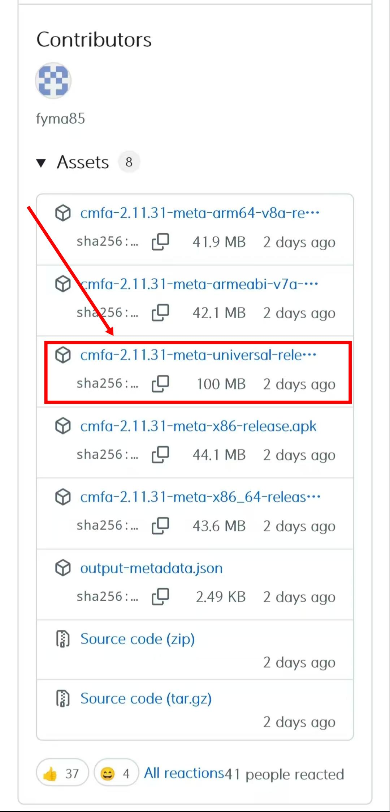
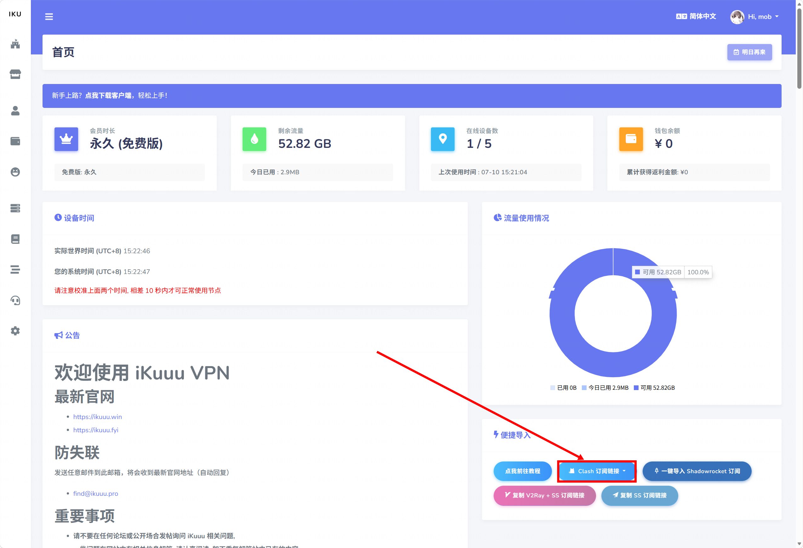

# 翻墙机场与 Clash ：新手入门指南

## 目录

- **前言**
  
- **基础概念**
  
- **步骤**
  
  - Clash 的下载与安装
    
  - 获取订阅
    
  - Windows 配置步骤
    
  - Android 配置步骤
    
- **常见问题排查**
  
- **安全与注意事项**
  
- **机场选择补充说明**
  

---

## 前言

本手册基于作者在 Windows 和 Android 平台上的实际使用经验编写，重点关注入门阶段最常见的问题与操作步骤。内容以“**能直接上手**”为目标，不展开过多原理推导。

macOS 用户操作逻辑与 Windows 基本一致（下载客户端 → 导入订阅 → 开启代理），可参考 Windows 章节的步骤，客户端推荐使用 Clash Verge Rev 的 macOS 版本。

## 基础概念

- **什么是机场：** “机场”是中文网络环境里对代理服务提供方的一种常见叫法，主要指提供订阅、节点和相关服务的平台。帮助用户绕过网络限制、访问被屏蔽的网站与服务。用户通常通过购买机场服务来获得订阅链接，然后导入 Clash 使用。
  
- **什么是Clash：** Clash 是一种代理客户端，用来帮助用户管理网络代理配置。它本身不是“网络资源”，而是一个工具，用户需要把配置文件或订阅信息导入到 Clash 里，才能正常使用。目前，社区存在多个基于 Clash 的活跃衍生版本（如 Clash Meta、Clash Verge 等），它们核心功能相同，配置和操作方法高度一致。为便于阅读，本教程统一使用 “ Clash ” 指代这些版本。
  
- **什么是订阅：** 订阅通常是一个链接或配置地址，里面包含了可用节点和相关配置信息。用户把订阅导入 Clash 后，客户端就能自动读取这些信息，不需要手动逐个填写节点参数。
  
- **什么是节点：** 节点可以理解为实际的代理连接入口。每个节点通常对应一个服务器地址、连接方式和相关参数，用户通过选择不同节点来连接外部网络。
  
  不同节点的区别，常见体现在延迟、速度、稳定性和可用性上。实际使用时，用户通常会根据测速结果和访问体验来选择节点。
  

## 步骤

### Clash 的下载与安装

#### Windows

##### 方法一：使用 WinGet 安装（推荐）

WinGet 是微软官方推出的包管理器，在 **Windows 10 1809（2018年10月更新）及更高版本**，以及 **Windows 11** 中通常都已内置。

1. 打开终端（以管理员身份）：

- 点击“开始”菜单，输入`cmd`或`PowerShell`
  
- 在搜索结果中，右键点击`命令提示符`或 `Windows PowerShell` ，选择”**以管理员身份运行**“
  

2. 确认 WinGet 已安装：

- 在打开的窗口中输入以下命令并回车：

```bash
winget --version
```

- 如果显示版本号（如 `v1.5. ...`），说明已安装。如果提示找不到命令，则需要先安装“应用安装程序”。你可以打开 **Microsoft Store**，搜索“**应用安装程序**”并安装

3. 安装 Clash

- 在终端中输入以下命令并回车：

```bash
winget install ClashVergeRev.ClashVergeRev
```

- 输入命令后，WinGet 会自动下载并安装，只需等待进度条走完即可

##### 方法二：手动下载并安装

1. 打开[官方下载链接](https://www.clashverge.dev/install.html)
  
2. 下载前先**确认设备类型**。如果不确定系统架构，Windows 用户一般可先选择 `x64` 版本
  
3. 下载完成后双击安装包，按照安装向导完成安装
  
4. 安装完成后打开客户端。如系统弹出权限提示，按提示允许程序运行
  

> 注意：部分版本首次启动时可能需要系统防火墙授权。若出现此类提示，可根据系统提示完成授权。

#### Android

1. 打开[安卓端下载链接](https://github.com/MetaCubeX/ClashMetaForAndroid/releases)
  
2. 下滑页面，在 **Assets** 区域找到最新版本的 `cmfa-*-meta-universal-release.apk` 文件（通用版，适用于绝大多数手机），点击下载 APK 文件到手机本地
  
  > 
  > 
  > **提示：** 文件名中的 `*` 为版本号，请选择**最新版本**下载，不必拘泥于教程截图中的具体版本号。若不确认手机架构，选择 `universal` 版本即可
  
3. 点击安装包开始安装
  
4. 如系统阻止安装，先允许`安装未知来源应用`
  
5. 安装完成后打开客户端，按提示授予必要权限
  

### 获取订阅

> 本节以 iKuuu 为例演示如何获取订阅链接。**如果您已经有可用的订阅链接，可以直接跳过本节**，前往对应平台的配置步骤继续操作。
> 
> iKuuu 为免费服务，仅用作入门演示，如遇官网无法访问，可尝试更换备用域名（如 `ikuuu.fyi`、`ikuuu.nl` 等）或搜索最新地址；
> 
> 若此前已导入过订阅，则官网不可用不影响节点使用。

- **注册**
  

1. 打开链接[登录 — iKuuu VPN](https://ikuuu.win/auth/login)
  
2. 点击页面下方的`马上注册`
  
3. 根据提示输入`昵称``邮箱``邮箱验证码``密码`，并勾选`注册即代表同意服务条款`
  
4. 点击`注册`
  

> 注意：若长时间未收到验证码，请查看邮件垃圾箱。

- **登录**
  

1. 输入`邮箱`和`密码`
  
2. 点击人机验证
  
3. 点击登录
  

- **获取订阅链接**
  

1. 进入`首页`
  
2. 下滑，选择`便捷导入`中的`Clash订阅链接`，点击`复制Clash订阅链接`
  



### Windows配置步骤

#### 导入订阅

1. 打开Clash客户端，在左侧一栏中选择`订阅`
  
2. 在`订阅文件链接`输入框中，输入刚刚从 iKuuu 官网中复制的 **Clash订阅链接** ，点击导入
  
3. 导入完成后，客户端会生成对应的订阅配置
  
4. 返回订阅列表，确认刚刚导入的配置是否已显示在列表中
  
5. 如列表中未显示内容，可尝试刷新页面或重新导入一次
  

#### 选择配置

1. 在订阅列表中，选中刚刚导入的配置
  
2. 切换到 `代理`页面，查看节点列表。选择一个**延迟较低、状态正常**的节点
  
3. 点击节点名称后，等待客户端完成切换
  

> 
> 
> 节点右侧的绿色数字表示的是延迟，单位通常是毫秒 `ms`。数值越小，说明节点响应越快，越适合优先使用
> 
> `Timeout` 表示这个节点在测试时没有在规定时间内返回结果。通常意味着不稳定或不可用

#### 开启系统代理

1. 在左侧一栏中选择`首页`，在客户端中找到 `系统代理` 开关，打开 `系统代理`
  
2. 根据使用情况选择代理模式
  

> **不同代理模式的区别**
> 
> - 规则（ Rule ）：按规则分流。国内网站直连，国外网站走代理
>   
> - 全局（ Global ）：所有流量都走代理，不做区分
>   
> - 直连（ Direct ）：所有流量都不走代理，直接连接
>   

#### 检查是否生效

1. 打开浏览器，访问一个常用网站。确认页面是否能够正常加载
  
2. 如果无法访问，检查以下内容：
  
  - 订阅是否导入成功
    
  - 节点是否已选中
    
  - 系统代理是否已开启
    
3. 如仍无法正常使用，可切换其他节点后再次测试
  

### Android 配置步骤

#### 导入订阅

1. 打开应用，点击`配置`，进入配置页面
  
2. 点击右上角`+`，选择`从 URL 导入`
  
3. 在`URL`输入框中粘贴订阅链接。设置名称后，点击保存
  
4. 等待配置下载完成。回到 `配置` 页面，确认刚刚导入的配置已显示在列表中
  

#### 激活配置

1. 在 `配置` 列表中，选择刚刚导入的配置
  
2. 返回首页。确认当前配置已生效
  
3. 如果界面显示未激活状态，重新点击一次配置名称
  

#### 开启代理

1. 在首页点击开关，启动代理
  
2. 系统会弹出 VPN 权限请求
  
3. 点击允许，完成授权
  
4. 授权后，代理功能即可生效
  

#### 选择节点

1. 进入 `代理` 页面
  
2. 在策略组中选择一个节点
  
3. 优先选择延迟较低、状态正常的节点
  
4. 点击节点名称后，等待切换完成
  

> 
> 
> 节点右侧的数字表示延迟，单位为毫秒。数值越小，说明节点响应越快。右下角的闪电图标用于测速或刷新节点延迟，点击后可重新检测节点状态

#### 测试是否可用

1. 打开浏览器，访问常用网站，检查是否可以正常打开
  
2. 如果无法访问，先检查以下内容：
  
  - 订阅是否导入成功
    
  - 配置是否已激活
    
  - 代理开关是否已开启
    
  - 节点是否可用
    

## 常见问题排查

客户端无法正常使用时，从订阅、节点、代理模式、本地网络四个方面逐一排查。

1. **订阅无法导入**
  如果导入后列表中没有出现配置，先确认订阅链接是否复制完整，是否包含多余空格或换行。若仍然失败，可尝试重新复制链接并再次导入
  如果您使用的是 iKuuu 等免费服务，且官网无法打开或订阅链接失效，通常是服务商临时不可用，**并非您的操作问题**。此时可尝试备用域名或稍后再试；若此前已导入过订阅，Clash 中的现有节点不受影响。如免费服务持续不可用，建议参考后文“机场选择补充说明”更换其他服务。
  
2. **怎么判断是节点问题还是配置问题**
  打开 Clash 的代理页面，查看节点列表——如果部分节点有延迟数字、部分节点显示 Timeout，说明配置正常，切换节点即可
  如果所有节点都显示 Timeout 或全部无法连接，说明配置可能有问题，优先检查订阅是否导入成功、系统代理是否开启、代理模式是否选对
  如果所有节点有延迟，但浏览器还是打不开网站，检查代理模式是否选择了“规则”或“全局”，不要选“直连”
  
3. **节点没有延迟或显示 Timeout**
  如果节点一直不显示延迟，或显示 `Timeout`，通常说明节点当前不可用、网络不稳定，或者测速没有成功。此时可先切换到其他节点，再重新测试
  
4. **开启代理后仍无法上网**
  如果已经导入订阅并选中节点，但浏览器仍无法访问目标网站，先检查代理模式是否正确、系统代理是否已经开启，以及当前节点是否可用。必要时可重新选择节点或刷新订阅。
  
5. **只有部分网站能打开**
  这种情况通常说明配置本身已生效，但当前节点的可用性或分流规则存在限制。可以尝试切换节点，再观察是否恢复正常。
  
6. **客户端无法启动或频繁闪退**
  如果客户端本身无法正常打开，优先检查安装包版本、系统权限和系统兼容性。对于 Windows 用户，还要确认是否安装了正确架构的版本
  

## 安全与注意事项

Clash 只是客户端工具，真正重要的是订阅来源、节点质量和使用习惯。对于新手来说，最重要的原则是：不要随意泄露订阅链接，不要使用来源不明的配置文件，也不要把同一套订阅长期公开分享给他人

1. **不要外传订阅链接**
  订阅链接通常和账号绑定，外传后他人可使用您的订阅，导致流量被消耗、账号被关联甚至封禁。同时，链接中可能包含用户标识信息，被他人获取后可能用于追踪您的使用行为。若订阅链接失效，应通过官方渠道重新获取，不要在网上随意搜索替代链接。
  
2. **不要随意使用来路不明的配置**
  Clash 的配置文件中可以定义代理转发规则和脚本行为。来源不明的配置可能将您的部分流量劫持到恶意服务器，或绕过您预期的代理路径，导致隐私泄露、访问记录被记录甚至账号密码被截获。尽量只使用服务商官方提供的订阅入口，避免导入他人分享的“精简版”“优化版”等来路不明的配置。
  
3. **谨慎对待涉及真实身份或资产的账户**
  使用代理时，网络流量会经过第三方服务器。如果节点存在恶意行为（如中间人攻击），您在银行、支付平台、实名社交账号等场景下的操作记录、登录凭证、交易信息可能被截获。并非所有节点都有此类风险，但在无充分了解前，建议将这类敏感操作放在直连网络或长期使用且信任的节点下进行。
  
4. **保持备份**
  代理服务可能因节点失效、服务商停运、配置文件误删等原因中断。建议至少保留一条备用订阅记录，或准备一个备用客户端，避免主服务无法使用时陷入被动。备份的存在不是为了经常切换，而是为了防止万一。
  

## 机场选择补充说明

对于已经完成首次使用的读者，机场选择可以作为后续补充内容，而不必作为入门阶段的前置条件。新手阶段的目标是先完成一次可用配置；等到能够正常导入、切换和使用之后，再回头比较稳定性、速度、套餐和客服支持更为合适

1. **先看可用性**
  如果只是想先能用起来，优先选择能稳定提供订阅链接、说明清楚、支持短周期测试的服务即可。不要一开始就追求所有维度都最优
  
2. **再看稳定性**
  如果已经有使用经验，再进一步关注线路类型、晚高峰表现、节点稳定性和售后响应。不同服务在不同时间段和地区的表现可能差异很大
  
3. **最后看套餐**
  套餐选择应和自己的使用频率匹配。轻度用户通常只需要基础套餐；高频用户则更适合更高流量或更高稳定性的套餐
  

###
